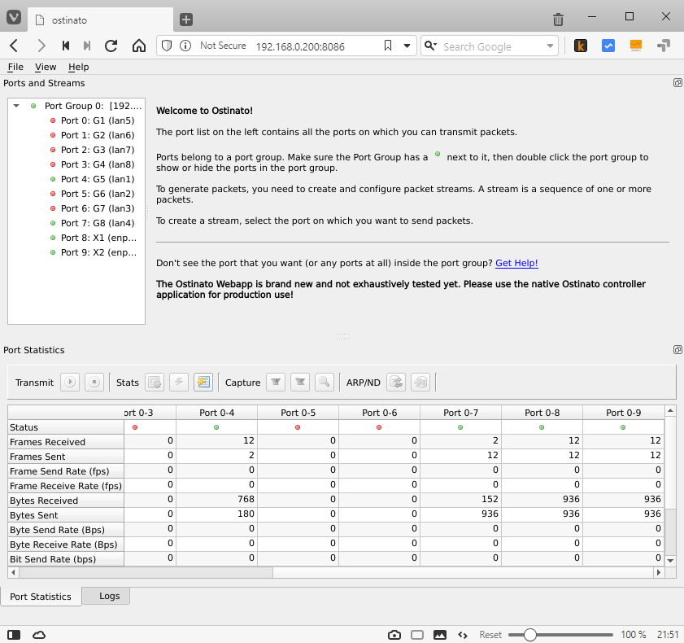

# Elevate the EXA8 with the Ostinato traffic generator

This repository contains the code for [Ostinato](https://ostinato.org) ported for Cubro's EXA8 hardware. This is my entry for the [Elevate the EXA8](https://www.cubro.com/en/about-us/exa8-contest/) contest.

**Update: Ostinato for EXA8 was adjudged :trophy: [joint winner](https://www.businesswire.com/news/home/20200804005499/en/Cubro-Announces-the-EXA8-Challenge-Winners) of the contest!**

_Srivats (Author, Ostinato)_

# Installation
Before we download, install and run the exa8-ostinato package, we need to prepare the EXA8 first. The below steps need to be **run only the first time**. All steps, unless otherwise indicated, need to be performed on the EXA8.

## Use Kernel driver instead of DPDK for Ethernet ports
The pre-installed exa8 application puts all the ethernet ports under DPDK control. Ostinato uses Linux Kernel drivers instead of DPDK to access the ethernet ports, so our first step is to get the ethernet ports under Linux Kernel control.

Comment out **ALL** the following lines in `/mnt/data/arm_package/run_arm.sh` -
```sh
#./dpdk-devbind.py --bind vfio-pci 0000:05:00.1
#./dpdk-devbind.py --bind vfio-pci 0000:05:00.2
#./dpdk-devbind.py --bind vfio-pci 0000:05:00.3

#insmod ./mvmdio_uio.ko

#./exa8_adapter_app board=exa8 xv=tap
```

That should bring the X1, X2 interfaces (and the internal 10G port connected to the 1x8G switch) under kernel control - after a reboot. But don't reboot just yet. We need to get the G1-G8 ports also under Kernel control. To do that, dump the current value of the uboot `fdt_update` variable -

```sh
$ sudo fw_printenv | grep fdt_update
fdt_update=fdt adds ${fdtcontroladdr};fdt resize 4096;fdt set /soc/pci/mrml-bridge0/mdio-nexus/mdio1 phandle <0x4e>;fdt set /soc/pci/mrml-bridge0/mdio-nexus/mdio1/switch0 status disabled;fdt mknode / switch;fdt set /switch compatible marvell,mvmdio-uio;fdt set /switch status okay;fdt set /switch mii-bus <0x4e>
```

Your output may not be exactly the same. The important thing to note is the `/soc/pci/mrml-bridge0/mdio-nexus/mdio1/switch0` which is the device that the kernel has a driver for is set to `status disabled` and `/switch` (Cubro proprietary driver) is set to `status okay`. Both these devices refer to the same physical device (the 8x1G port switch in the EXA8) and there can be only one driver active at a time for this device. We need to swap the status for those two devices so that the kernel driver gets to use the device.

To do that, update that variable -
```sh
$ sudo fw_setenv fdt_update fdt adds ${fdtcontroladdr};fdt resize 4096;fdt set /soc/pci/mrml-bridge0/mdio-nexus/mdio1 phandle <0x4e>;fdt set /soc/pci/mrml-bridge0/mdio-nexus/mdio1/switch0 status okay;fdt mknode / switch;fdt set /switch compatible marvell,mvmdio-uio;fdt set /switch status disabled;fdt set /switch mii-bus <0x4e>
```

**Reboot the device** before proceeding further so that the above changes take effect.

Use `ifconfig -a` to verify that the `enp5s0f[1-3]` and `lan[1-8]` devices are created. If they are created but down, use `sudo ifconfig <intf-name> up` to administratively enable them.

Note: `enp5s0f1` (the internal 10G port connected to the 8x1G switch) MUST be up for the lan[1-8] devices to come up.

If you don't see the lan[1-8] ports, use `sudo fw_printenv | grep fdt_update` to verify that the change is reflected after the reboot.

## Install dependencies
The `exa8-ostinato` package depends on other packages to run. Let's install those now. Package names sometimes change across distros and distro versions. The below package names are for Ubuntu 16.04 LTS that ships by default on the EXA8.

```sh
sudo apt install libqt5core5a libqt5network5 libqt5script5 libpcap0.8 libprotobuf9v5 libnl-3-200 libnl-route-3-200
```

We also need python package `websockify` v0.8.0 -
```sh
pip3 install websockify==0.8.0
```

If `pip3` is not found, run `sudo apt install python3-pip` to install it first.

_Why websockify?_ The Ostinato GUI code uses native sockets, but browsers allow only websockets; websockify acts as a proxy between the two.

## Install exa8-ostinato
Now we are all setup for exa8-ostinato.

Download the latest [binary release](https://github.com/pstavirs/elevate-the-exa8/releases) onto the EXA8. Extract it into `/mnt/data` (or some other location) -
```sh
cd /mnt/data
tar zxvf <path-to-exa8-ostinato-tgz>
```

## Run exa8-ostinato
To run the package -
```sh
cd exa8-ostinato
sudo ./run.sh
```

That will run the Ostinato Drone agent providing the packet generation facilities and a HTTP server for the webapp.

To access the webapp UI, open a browser on your laptop/desktop connected via the `MGMT` eth port to the EXA8 to the URL `http://<exa8-ip>:8086/`

You should see the Ostinato GUI open as a webapp in the browser -



NOTE: Due to security restrictions and a sandboxed environment imposed on web applications by the browser, use only a IP address in the URL instead of a host/domain name to access the Ostinato Web UI.

The Ostinato webapp uses WebAssembly technology which is fairly recent, so make sure you use a modern and recent browser version that supports WebAssembly.

Look at the [Ostinato documentation](https://userguide.ostinato.org) on how to use Ostinato.

### Important note on the Ostinato WebUI
Webassembly is still developing as a technology. Support for it within build toolchains, Qt (the UI toolkit used by Ostinato) etc. is also work in progress currently and has limitations and sometimes even bugs. One major limitation (from Ostinato point of view) is the lack of support for modal dialogs - a workaround for it exists and I've made changes to the Ostinato code to use that workaround for typical actions that use modal dialogs, but **NOT** for all modal dialogs in the UI. Also opening/saving files from the local filesystem is not permitted by the browser sandbox model, so the _Open/Save Session_ and _Open/Save Straams_ functionality has been removed from the webapp for the time being.

If the Ostinato WebUI gets stuck at any point, just refresh the page.

The Ostinato WebUI has certain advantages for vertically integrated solutions like the EXA8 -
* Users don't need to install native GUI clients; they just point the browser to the EXA8
* Users don't need to worry about compatibility of locally installed native clients and the EXA8 server software
* Easier upgradability and maintenance - both server and client (UI) are co-located and under administrator control

However, if the Ostinato WebUI isn't behaving properly, please use a native Ostinato GUI for your platform to connect to the EXA8 instead of the WebUI. Prebuilt binaries are available on the [Ostinato website](https://ostinato.org/pricing) or you could [build from source](https://devguide.ostinato.org/BuildingFromSource.html).

Have fun playing with packets!

# Building from source
If for some reason, you don't want to use the prebuilt exa8-ostinato package, follow instructions in this section to build everything from source.

Make sure you understand the [Ostinato agent-controller architecture](https://userguide.ostinato.org/Architecture.html) first before proceeding. The code (and this document) will use the terms agent/server/drone interchangeably - they all refer to the same entity. Similarly the terms controller/client.

## Drone agent
The drone agent runs on the EXA8 and so should be built natively on the box or cross-compiled for the EXA8. The below instructions are for native build; adapt it accordingly for a cross build.

Make sure you have the basic build tools available (`build-essential` package) and then install the following dependencies (package names assuming Ubuntu 16.04 LTS) -

```sh
sudo apt install qtbase5-dev qtscript5-dev libpcap-dev protobuf-compiler libprotobuf-dev libnl-3-dev libnl-route-3-dev
```

Clone the repo and build just the agent -

```sh
git clone https://github.com/pstavirs/elevate-the-exa8 ostinato-drone
cd ostinato-drone
make server
```

This should generate the `server/drone` agent binary.

## Ostinato GUI controller (webapp)
The Ostinato GUI controller runs on users' laptop/desktop and connects to the drone agent running on the EXA8 to configure and control the agent.

Usually, the Ostinato GUI is compiled for each supported platform natively - Windows, MacOs, Linux (various distros). However, since the EXA8 can be offered as a vertically integrated platform, we will build the Ostinato controller GUI as a webapp instead that can run on a browser on any platform. The webapp will be hosted on the EXA8 itself and accessed via HTTP like any other web site/app.

The advantages of a webapp are -
* No hassle of building natively on each supported platform
* Easier upgrades/deployments - the agent and controller version has to match for them to be compatible. By keeping them both together on the EXA8, upgrades are easier as users don't need to make sure they have a compatible GUI controller

The Ostinato code is in Qt/C++, not a web native language. We use [emscripten](https://emscripten.org/) to build a [webassembly](https://webassembly.org/) target of the code that can run on modern browsers. By its very nature, this is a cross-build. So, you should **NOT** build this on the EXA8 but on a host - Windows or Linux.

### Build/Get Qt for Wasm
Since Ostinato uses the Qt toolkit, we need to build the Qt libraries for Webassembly (wasm). Install the required versions of `emscripten` and compatible Qt versions using the [Qt for Webassembly](https://doc.qt.io/qt-5/wasm.html) instructions. Instead of building the Qt libraries from source you can also download the pre-built libraries linked on that same page - it's much easier (and faster!). But you still need to install the correct emscripten version compatible with the Qt version you are using.

### Build protobuf for Wasm
It's easier to do this on Linux than Windows because `autotools` is needed for this. Note that it does not matter whether you used Windows or Linux for Qt/WASM because everything is essentially cross compiled for WASM.

Use [protobuf v3.9.0](https://github.com/protocolbuffers/protobuf/releases/tag/v3.9.0) alongwith [protobuf-wasm patch](https://github.com/kwonoj/protobuf-wasm) for this specific version.

**IMPORTANT: Use the same emscripten version that you used for Qt**

```sh
emconfigure ./configure
emmake make
emmake make prefix=<install-dir> install
```

`<install-dir>` above refers to where the protobuf include headers and built libraries will be published for other source code (such as Ostinato) to use.

**IMPORTANT: Don't use the system `/usr` or `/usr/local` as the install-dir above because this is a cross build. Use another exclusive directory instead**

### Build Ostinato for Wasm
Export the location of the protobuf install include/lib directory as environment variables -

```sh
export CPLUS_INCLUDE_PATH=/path/to/protobuf-wasm/install/dir/include
export LIBRARY_PATH=/path/to/protobuf-wasm/install/dir/lib
```

Let's build Ostinato for WASM now -

```sh
git clone https://github.com/pstavirs/elevate-the-exa8 ostinato-wasm
cd ostinato-wasm
/path/to/qt-wasm/qtbase/bin/qmake -config release
make client
```

**Notes**
* Make sure you use the wasm version of `qmake`, not the native version
* If the linking phase fails with undefined protobuf symbols, manually modify the `LIBS` variable in `client/Makefile.ostinato` to provide path of protobuf library to the linker using `-L <path-to-protobuf-wasm-lib>` - the emscripten/clang linker seems to (incorrectly) ignore the `LIBRARY_PATH` env var.
* To view the debug logs, please link with `--emrun` option and while loading the webapp, append `?-d` to the URL

The build artifacts (aka binaries) should be in the `ostinato-wasm/client` directory -
```sh
ostinato.wasm
ostinato.js
ostinato.html
qtloader.js
```

Next, package the wasm artifacts into a .tgz so that we can take 'em to the exa8-

```sh
cd ostinato-wasm/exa8
sh mk-wasm-pkg.sh
```

Note: The packaging script is a unix shell script; if on Windows, use `wsl sh mk-wasm-pkg.sh` (you need to have WSL - Windows Subsystem for Linux installed).

This will generate `exa8-ostinato.tgz` that you then copy to the `ostinato-drone/exa8` directory on the EXA8.

### Final packaging
The `exa8-ostinato.tgz` package that you just copied contains only the webapp files. We need to add the drone agent binary files to it. To do that -

```sh
cd ostinato-drone/exa8
sh mk-exa8-pkg.sh
```

The final package should have the following contents -
```sh
srivatsp@exa8$ tar ztf exa8-ostinato.tgz
exa8-ostinato/webapp/index.html
exa8-ostinato/webapp/ostinato.html
exa8-ostinato/webapp/ostinato.js
exa8-ostinato/webapp/ostinato.wasm
exa8-ostinato/webapp/qtloader.js
exa8-ostinato/webapp/logo.png
exa8-ostinato/run.sh
exa8-ostinato/drone.ini
exa8-ostinato/drone
srivatsp@exa8$
```

This package is similar to the release package. Follow the instructions in the [Installation section](#installation) to install and run.
